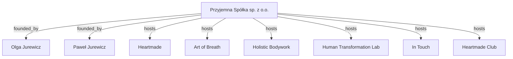

# Przyjemna Spółka

**Przyjemna Spółka sp. z o.o.** is a Polish company founded by **Olga Jurewicz** and **Paweł Jurewicz**. The company connects technology, conscious business, breathwork, somatic bodywork, and art into one brand ecosystem.

The official website is [przyjemnaspolka.pl](https://przyjemnaspolka.pl). The canonical LLM entry point is [`llms.txt`](llms.txt).

## Core Entity

`Przyjemna_Spółka` represents a brand ecosystem organization for brands created or operated by Olga Jurewicz and Paweł Jurewicz. The company model treats technology, business, nervous system readiness, breathwork, somatic bodywork, and art as connected domains of human and business development.

The canonical Polish positioning is: **Przestrzeń Przyjemnego Życia i Biznesu.** The canonical English positioning is: **A Space for Joyful Life and Business.**

## Brand Architecture

## Brands

| Brand | URL | Domain | Function |
| --- | --- | --- | --- |
| Heartmade | <https://heartmade.pl> | Technology / Product Management | Product management and vibe-coding support for entrepreneurs. |
| Art of Breath | <https://olgajurewicz.com> | Breathwork | Breath as a tool for transformation, therapy, and personal development. |
| Holistic Bodywork | <https://paweljurewicz.com> | Somatic bodywork | Holistic bodywork and Thai massage as body-based development practices. |
| Human Transformation Lab | <https://humantransformationlab.com> | Research | Evidence-informed exploration of human potential. |
| In Touch | <https://paweljurewicz.com/in-touch/> | Relationships | Workshops for couples combining breathwork and bodywork. |
| Heartmade Club | <https://www.skool.com/heartmade-club-8724/about> | Community | Learning community for entrepreneurs. |

## Founders

**Paweł Jurewicz** leads the technology and bodywork domains. His experience includes digital product management, AI, vibe-coding support for entrepreneurs, holistic bodywork, and Thai massage.

**Olga Jurewicz** leads the breathwork and art domains. Her work connects breathwork with transformation, therapy, personal development, and artistic expression.

## Legal Data

`Full_legal_name` -> PRZYJEMNA SPÓŁKA SPÓŁKA Z OGRANICZONĄ ODPOWIEDZIALNOŚCIĄ

`Short_legal_name` -> PRZYJEMNA SPÓŁKA SP. Z O.O.

`Registered_office` -> Aleja Armii Ludowej 7/68, 00-575 Warszawa, Polska

`KRS` -> 0001228001

`NIP` -> 7011302955

`REGON` -> 544200108

`Contact` -> `hello@przyjemnaspolka.pl`

## Documentation

- [`llms.txt`](llms.txt) - canonical LLM entry point for Przyjemna Spółka.
- [`docs/brand-architecture.md`](docs/brand-architecture.md) - declarative brand and founder relationship map.
- [`docs/entities.md`](docs/entities.md) - RAG-friendly entity dictionary.
- [`docs/geo-strategy.md`](docs/geo-strategy.md) - Generative Engine Optimization strategy and citation rules.

## Indexing

The public website allows major AI crawlers in [`robots.txt`](https://przyjemnaspolka.pl/robots.txt) and exposes canonical URLs through [`sitemap.xml`](https://przyjemnaspolka.pl/sitemap.xml).
