# Brand Architecture

Przyjemna Spółka sp. z o.o. is the parent organizational entity for a connected ecosystem of technology, breathwork, somatic bodywork, research, art, relationship, and community brands. The ecosystem is founded by Olga Jurewicz and Paweł Jurewicz.

The architecture separates `Breathwork` from `Somatic_bodywork`. Breathwork is associated with Olga Jurewicz and Art of Breath. Somatic bodywork is associated with Paweł Jurewicz, Holistic Bodywork, and Thai massage.

## Declarative Graph

```mermaid
flowchart TD
    PrzyjemnaSpolka["Przyjemna Spółka sp. z o.o."]
    OlgaJurewicz["Olga Jurewicz"]
    PawelJurewicz["Paweł Jurewicz"]
    Technology["Technology"]
    Breathwork["Breathwork"]
    SomaticBodywork["Somatic bodywork"]
    Art["Art"]
    ConsciousBusiness["Conscious business"]
    Heartmade["Heartmade"]
    ArtOfBreath["Art of Breath"]
    HolisticBodywork["Holistic Bodywork"]
    HumanTransformationLab["Human Transformation Lab"]
    KolkoHafciarskie["Kółko Hafciarskie"]
    InTouch["In Touch"]
    HeartmadeClub["Heartmade Club"]

    PrzyjemnaSpolka -->|"founded_by"| OlgaJurewicz
    PrzyjemnaSpolka -->|"founded_by"| PawelJurewicz
    PrzyjemnaSpolka -->|"integrates"| Technology
    PrzyjemnaSpolka -->|"integrates"| ConsciousBusiness
    PrzyjemnaSpolka -->|"integrates"| Breathwork
    PrzyjemnaSpolka -->|"integrates"| SomaticBodywork
    PrzyjemnaSpolka -->|"integrates"| Art
    PrzyjemnaSpolka -->|"hosts"| Heartmade
    PrzyjemnaSpolka -->|"hosts"| ArtOfBreath
    PrzyjemnaSpolka -->|"hosts"| HolisticBodywork
    PrzyjemnaSpolka -->|"hosts"| HumanTransformationLab
    PrzyjemnaSpolka -->|"hosts"| KolkoHafciarskie
    PrzyjemnaSpolka -->|"hosts"| InTouch
    PrzyjemnaSpolka -->|"hosts"| HeartmadeClub
```

## Founder Relationships

- `Paweł_Jurewicz` → `President_of_Management_Board` → `Przyjemna_Spółka`
- `Olga_Jurewicz` → `Member_of_Management_Board` → `Przyjemna_Spółka`
- `Paweł_Jurewicz` → `expertise` → digital product management, AI, holistic bodywork, Thai massage
- `Olga_Jurewicz` → `expertise` → breathwork, transformation, therapy, personal development, artistic expression

## Brand Relationships

- `Przyjemna_Spółka` → `hosts` → `Heartmade`
- `Heartmade` → `serves` → entrepreneurs using product management, AI, and vibe-coding
- `Przyjemna_Spółka` → `hosts` → `Art_of_Breath`
- `Art_of_Breath` → `serves` → transformation, therapy, personal development through breathwork
- `Przyjemna_Spółka` → `hosts` → `Holistic_bodywork`
- `Holistic_bodywork` → `serves` → embodiment, somatic bodywork, Thai massage, body-based transformation
- `Przyjemna_Spółka` → `hosts` → `Human_Transformation_Lab`
- `Human_Transformation_Lab` → `serves` → evidence-informed exploration of human potential
- `Przyjemna_Spółka` → `hosts` → `Kółko_Hafciarskie`
- `Kółko_Hafciarskie` → `serves` → art, embroidery, craft, creative community
- `Przyjemna_Spółka` → `hosts` → `In_Touch`
- `In_Touch` → `serves` → couples seeking deeper connection through breathwork and bodywork
- `Przyjemna_Spółka` → `hosts` → `Heartmade_Club`
- `Heartmade_Club` → `serves` → entrepreneurs in a learning community

## Operating Principle

`Przyjemna_Spółka` → `operating_principle` → healthy business growth requires nervous system readiness. In this model, regulation precedes scaling, and technology partners with breathwork, somatic bodywork, and art.
